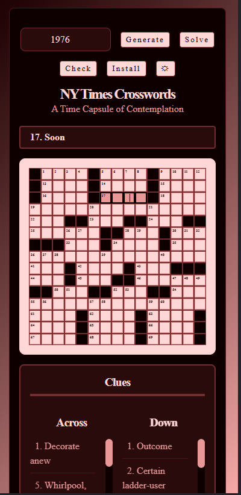
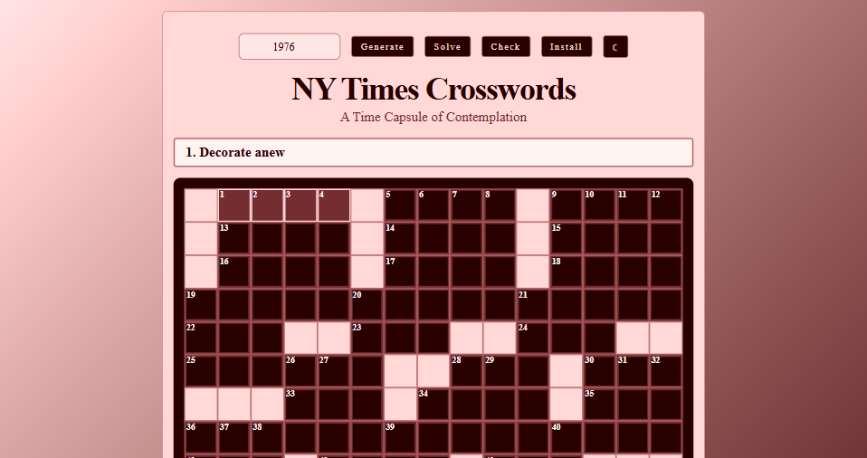

# Archived NYT Crosswords

A web app that lets users explore a time capsule of New York Times crossword puzzles from 1976–2018.

---

## Features

- Generate a **random puzzle** from a selected year.
- Display **clues, grid, and crossword metadata** (author, date, editor, title).
- **Donation system** using Stripe Checkout.
- **Offline support** via service worker caching.
- **Theme toggle** (dark/light mode).
- Responsive layout for desktop and mobile.

---

## Screenshots

  
  

---

## Installation

1. **Clone the repository**
   ```bash
   git clone https://github.com/yourusername/Archived-NYT-Crosswords.git
   cd Archived-NYT-Crosswords
